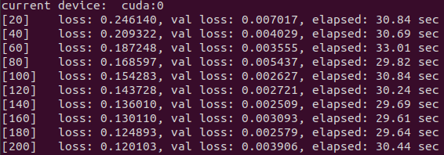
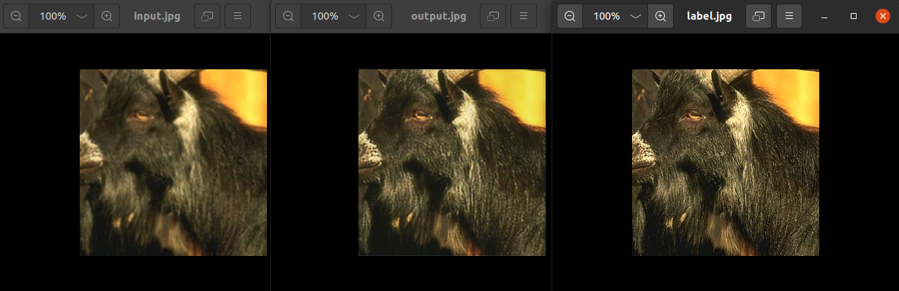
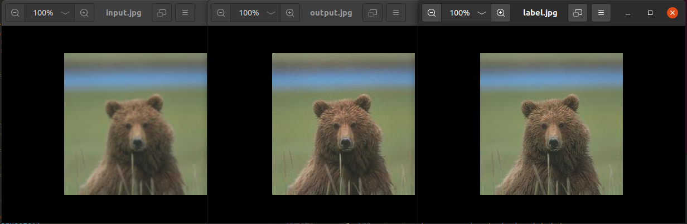
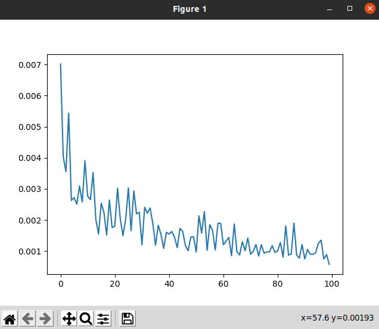
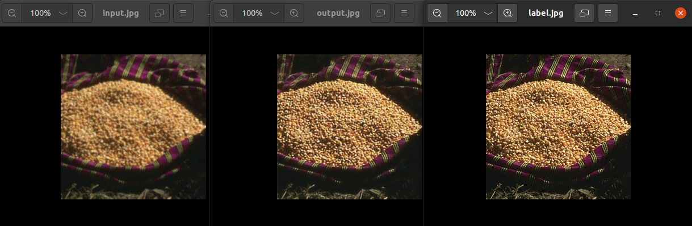

# 📕 Introduction

基于pytorch实现的[SRCNN](http://personal.ie.cuhk.edu.hk/~ccloy/files/eccv_2014_deepresolution.pdf)(Super-Resolution Convolutional Neural Network)

* Dataset: [BSDS300](https://www2.eecs.berkeley.edu/Research/Projects/CS/vision/grouping/segbench/BSDS300-images.tgz) (Train: 180, Validation: 20, Test: 100)

* Preprocessing:  `transforms.GaussianBlur(15, 1)`

* Architecture of entire network

  ```python
  self.patch_extraction = nn.Conv2d(3, 64, kernel_size=5, padding=5//2)
  self.non_linear = nn.Conv2d(64, 32, kernel_size=1)
  self.reconstruction = nn.Conv2d(32, 3, kernel_size=9, padding=9//2)
  ```


## 🤔 How To Run

1. Install the [requirement](https://raw.githubusercontent.com/Lin-CX/deep-learning/main/requirements_dl.txt) packages of this project.
2. `git clone https://github.com/Lin-CX/srcnn`
3. `python3 fsrcnn.py`


## Some Screenshots

### 🎈 Running

* Print device first
* Print info(train and val loss, elapsed) every 20 epochs




### 🎈 Result when 700, 900, 1400 iterations (trainset)

* 700 iterations



* 900 iterations


* 1400 iterations




### 🎈 Result of 2000 epochs

* Validation loss visualization (save **validation loss** every 20 epochs)



* Image of input, output and label. (**testset**)




## 📰 最后说一下感想

这是第一次实现超分辨率算法，因为是第一次所以选了个比较简单的SRCNN。有很多不懂和没了解过的地方，但是在实现的过程中慢慢理解了很多，接下来要尝试更多复杂的算法，先从FSRCNN开始。

